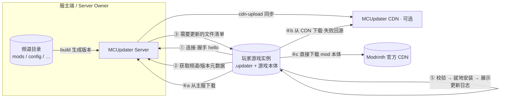

<a id="readme-top"></a>

<!-- PROJECT SHIELDS -->
[![Stars][stars-shield]][stars-url]
[![Forks][forks-shield]][forks-url]
[![Contributors][contributors-shield]][contributors-url]
[![Issues][issues-shield]][issues-url]
[![License: GPL-3.0][license-shield]][license-url]

<!-- PROJECT LOGO / TITLE -->
<br />
<div align="center">
  
  <h3 align="center">MCUpdater</h3>
  <p align="center">
    A modular auto-update & distribution system for Minecraft server / client resources.
    <br />
    <b>一个用于 Minecraft 服务端 / 客户端资源的模块化自动更新与分发系统。</b>
    <br />
    <br />
    <a href="#about-the-project"><strong>Explore the docs » / 查看文档 »</strong></a>
    <br />
    <br />
    <a href="#getting-started">Getting Started / 快速开始</a>
    &middot;
    <a href="#usage">Usage / 使用方法</a>
    &middot;
    <a href="#design">Design / 设计</a>
    &middot;
    <a href="https://github.com/ATCraft-Network/MCUpdater/issues/new?labels=bug">Report Bug / 反馈 Bug</a>
    &middot;
    <a href="https://github.com/ATCraft-Network/MCUpdater/issues/new?labels=enhancement">Request Feature / 建议功能</a>
  </p>
</div>

<!-- TABLE OF CONTENTS -->
<details>
  <summary>Table of Contents / 目录</summary>
  <ol>
    <li><a href="#about-the-project">About The Project · 项目简介</a></li>
    <li><a href="#built-with">Built With · 技术栈</a></li>
    <li><a href="#getting-started">Getting Started · 快速开始</a></li>
    <li><a href="#usage">Usage · 使用方法</a></li>
    <li><a href="#design">Design · 项目设计</a></li>
    <li><a href="#roadmap">Roadmap · 开发计划</a></li>
    <li><a href="#contributing">Contributing · 参与贡献</a></li>
    <li><a href="#license">License · 许可证</a></li>
    <li><a href="#contact">Contact · 联系方式</a></li>
    <li><a href="#acknowledgments">Acknowledgments · 致谢</a></li>
  </ol>
</details>

<!-- ABOUT THE PROJECT -->
## About The Project · 项目简介

**MCUpdater** keeps a Minecraft server and its players' clients in sync automatically. Instead of forcing every player to manually download mods and resource packs, the server owner maintains one or more *update channels* — ordinary folders (a modded server directory, a client assets folder, etc.). When files in those folders change, the server builds a *version snapshot*, and every client then downloads **only what changed**, verifies it, and applies it **in place inside the game instance** — no duplicated full packs, no missing pieces.

> **MCUpdater** 让 Minecraft 服务端与其玩家的客户端保持自动同步。服主不再需要让每个玩家手动下载 mod / 资源包：你只需维护一个或多个“更新频道”（普通的文件夹，例如某个整合包的服务端目录、客户端资源目录）。当其中的文件发生变更时，服务端会生成一份“版本快照”，随后每个客户端**只下载变化的部分**，校验通过后**就地写入游戏实例目录**——既不用反复整包重下，也不会出现文件缺失。

Here's why it was built / 为什么要做这个项目：

* 整包更新往往体积巨大、全量重下浪费时间 — full-pack updates are huge and wasteful; MCUpdater only transfers changed files.
* 模组/服务端文件容易“缺一块、错一个版本” — manual distribution causes missing or mismatched files; checksums keep every client identical.
* 分发渠道单一、带宽紧张 — you can fan out via the update server, an optional **CDN**, and **Modrinth's own CDN** for mods.

Key features / 核心功能一览：

| | |
|---|---|
| 🔁 增量更新 | Only the files changed since the client's last version are transferred. 只同步客户端上次更新以来发生变化的文件 |
| 📦 更新频道 | Multiple channels (`server`, `client-enforced`, `client-optional`...), each `required` or optional, toggleable by the player on first install. 多频道管理，可设“必装 / 选装”，首次安装由玩家按需勾选 |
| ✅ 完整性校验 | Every file is protected by a **SHA-256** digest; received data is re-hashed and verified before install. 每个文件带 SHA-256 校验，安装前再次校验 |
| 🌐 多渠道分发 | Files come from the main server, a standalone **CDN**, or external HTTP (Modrinth) — failed downloads fall back automatically. 主服务器 / CDN 加速 / Modrinth 外链 多种来源，失败自动回源 |
| 🧩 自动识别 Mod | During version build, mods are recognized (via Modrinth API) and fetched directly from the mod's own CDN. 构建版本时自动识别 mod（Modrinth API），让玩家从 mod 官方 CDN 下载 |
| 🖥 就地安装 | The updater lives in the game instance and writes results straight into `mods/`, `config/`, etc. 更新器运行在游戏实例目录内，直接在原目录中更新资源 |
| 🪟 图形更新器 | A lightweight Swing client with start/install/process/log/error screens; can be launched standalone or as a `-javaagent` of the game JVM. 提供简洁的图形更新器（安装/进度/更新日志等界面），可独立运行也可作为游戏 JVM 的 agent |
| ⌨ 控制台管理 | A simple console (`build`, `reload`, `stop`, `cdn-upload`) manages the whole lifecycle. 服主通过简单控制台命令完成全部管理 |

> MCUpdater 由 Client(更新器)、Server(更新服务器)、CDN(可选加速服务器) 与 Common(公共协议/模型) 四个模块组成，运行仅依赖 JDK 17+，无需数据库。详见 <a href="#design">Design · 设计</a>。

<p align="right">(<a href="#readme-top">back to top · 返回顶部</a>)</p>

### Built With · 技术栈

* [](https://www.oracle.com/java/technologies/javase/jdk17-archive-downloads.html) / Java 17
* [](https://gradle.org/) / Gradle multi-module build
* [](https://netty.io/) · [gb2022 simpnet](https://github.com/Grass-Block) — custom binary packet protocol / 自定义二进制 TCP 协议
* [](https://www.formdev.com/flatlaf/) — client GUI / 客户端图形界面
* Gson / Log4j2 / (modified) Bukkit `YamlConfiguration` / Velocity API (optional CDN plugin mode)
* Minecraft-related APIs: Modrinth, CurseForge (mod recognition) / Modrinth、CurseForge mod 识别

<p align="right">(<a href="#readme-top">back to top · 返回顶部</a>)</p>

<!-- GETTING STARTED -->
## Getting Started · 快速开始

This section walks you through the three deployable components. Every component reads/writes data **relative to its own working directory** (`user.dir`) — you can drop a jar anywhere and it will manage files next to itself. / 下面分别介绍三个可部署组件。所有组件都以**自身工作目录（`user.dir`）**为数据根目录，把 jar 放到哪，它就在哪管理文件。

### Prerequisites · 环境要求

* **JDK 17+** for the server, CDN and client. / 服务端、CDN 与客户端均需 JDK 17+。
* No database or web server is required. / 无需数据库，无内置 HTTP 依赖。

### 1. Update Server · 更新服务器

1. Put the jar in a folder and start it once to generate the config template (the server exits after first run):
   将 jar 放入一个空文件夹并启动一次，用于生成配置模板（首次运行会生成 `config.yml` 后自动退出）：

   ```sh
   java -jar mc-updater-server.jar
   # generated: config.yml
   ```

2. Edit `config.yml` — bind address/port, and point each `channels.<id>.path` at the folder you want to version & distribute (e.g. your modded server directory). See [Usage](#usage) for a full example.
   编辑 `config.yml`：配置绑定地址/端口，并把每个 `channels.<id>.path` 指向你想要“版本化并分发”的文件夹（例如整合包服务端目录）。完整示例见 [Usage · 使用方法](#usage)。

3. Start it again and manage it from the console / 再次启动，并在控制台管理：

   ```sh
   java -jar mc-updater-server.jar
   ```

### 2. Client Updater · 客户端更新器

1. Create the client config inside the game instance (the folder that contains `mods/` etc.) / 在游戏实例目录（含 `mods/` 等子目录的文件夹）下创建客户端配置：

   ```properties
   # .updater/mcu-client.properties
   brand=My Server            # 显示在更新器标题/欢迎页的品牌名
   service=update.example.com:65321   # 更新服务器 host:port
   ```

2. Ship `mc-updater-client.jar` into the instance. The updater runs either standalone or as a `-javaagent` of the game JVM (entry: `org.atcgroup.mcupdater.client.Main`, which provides both `main` and `premain`).
   将 `mc-updater-client.jar` 放进实例。更新器既可独立运行，也可作为游戏 JVM 的 `-javaagent` 注入运行（入口 `org.atcgroup.mcupdater.client.Main`，同时提供 `main` 与 `premain`）。

3. On first launch players pick which channels to install; afterwards it just updates. 玩家首次启动时选择安装的频道，之后每次启动自动完成增量更新。

### 3. CDN Server · CDN 加速服务器 (optional / 可选)

Serve resource packs from a separate machine to relieve the update server. It uses the same binary protocol (no HTTP), and can also run as a **Velocity** plugin.
用一台独立机器分发资源包以减轻主服压力。它使用与主服相同的二进制协议（非 HTTP），也可以作为 **Velocity** 插件运行。

1. Configure `config.properties` in its working directory / 在其工作目录配置 `config.properties`：

   ```properties
   server.host=127.0.0.1
   server.port=63000
   ```

2. Enable it in the update server's `config.yml` and point clients at it (see [config example](#server-config)). 在主服 `config.yml` 中开启 `cdn-server` 并填写地址/端口/仓库与 token（见 [配置示例](#server-config)）。客户端会优先从 CDN 下载，失败自动回源主服。

<p align="right">(<a href="#readme-top">back to top · 返回顶部</a>)</p>

<!-- USAGE -->
## Usage · 使用方法

### Typical workflow for a server owner · 服主典型工作流

1. **Maintain the channel folders** — change/remove files in the directory that a channel points to (add a mod, bump a config...).
   **维护频道目录** — 在频道指向的目录中增删改文件（如加入一个 mod、改动配置）。
2. **Build a version** — in the server console / 在服务端控制台执行：

   ```sh
   build <channel> <version>
   ```

   MCUpdater diffs the channel folder against the last build, analyzes the changed files (auto-recognizing mods via Modrinth, packing small files into resource packs, keeping large files as raw blobs), and writes a new version snapshot.
   系统会将频道目录与上次构建做对比，分析变更文件（自动通过 Modrinth 识别 mod、把零散小文件打包成资源包、大文件按原样保留），并生成新的版本快照。
3. **Write the changelog** — fill `versions/<channel>/<version>.txt` with the update notes players will see.
   **填写更新日志** — 编辑 `versions/<channel>/<version>.txt`，内容会展示给玩家。
4. **Optional: sync the CDN** — run `cdn-upload` so the CDN also holds the new resource packs.
   **（可选）同步 CDN** — 执行 `cdn-upload`，把新资源包同步到 CDN。
5. **Players update automatically** — next time a client connects it fetches only the changes since its last version, verifies, installs in place, and shows the changelog.
   **玩家自动更新** — 客户端下次连接时只拉取自其上次版本以来的变更，校验后就地安装并展示更新日志。

### Console commands · 控制台命令

| Command · 命令 | Description · 说明 |
|---|---|
| `build <channel> <version>` | Create a version snapshot for a channel · 为频道生成版本快照 |
| `cdn-upload` | Upload all local resource packs to the CDN · 上传全部资源包到 CDN |
| `reload` | Reload `config.yml` · 重新加载配置文件 |
| `stop` | Stop the server · 停止服务器 |
| `help` | Show help · 显示帮助 |

### Server config · 服务端配置示例 <a id="server-config"></a>

```yaml
config:
  server-address: 0.0.0.0      # 监听地址
  server-port: 65321           # 更新服务器端口
  debug: false                 # 调试输出（反馈 bug 时开启）

  # 文件分析流水线：识别 mod / 决定压缩策略
  file-analyzer:
    order: [ "modrinth", "curseforge", "fallback" ]
    modrinth:
      base-url: "api.modrinth.com/v2"
    fallback:
      compress-threshold: 268435456   # 大于该大小的文件不再压缩（256 MiB）

  # 可选：CDN 加速服务器
  cdn-server:
    enable: false
    address: cdn.example.com
    port: 63000
    access-token: "YOUR_TOKEN"
    repository: test

  # 更新频道列表（目录 -> 版本 -> 分发）
  channels:
    server:                    # 频道唯一 ID
      required: true           # 是否强制安装（默认 false）
      name: 服务端资源
      desc: 默认的服务端核心玩法资源。
      path: "/data/mcu/server" # 被跟踪的目录（建议指向你的服务端目录）
      filter-block: [ ]        # 强制屏蔽（优先生效）
      filter-reject:           # 拒绝这些路径前缀
        - "/plugins/"
        - "/server.properties"
      filter-add:              # 最后放行这些路径前缀（优先于拒绝）
        - "/mods"
```

* **Filters** decide which relative paths inside a channel folder get distributed. `filter-block` (always wins) → `filter-reject` (deny prefixes) → `filter-add` (allow prefixes, applied last). 过滤器决定频道目录内哪些相对路径会被分发，按 `filter-block`(强制屏蔽) → `filter-reject`(拒绝前缀) → `filter-add`(最后放行) 的顺序生效。
* Setting a channel's `path` directly to your Minecraft server directory is an easy way to version a live server — its content will be reflected to clients through the filters above. 直接把 `path` 指向你的 Minecraft 服务端目录即可对“线上服务端”做版本管理，经上面的过滤器分发到客户端。

### Client behavior · 客户端行为

* **First run** — after connecting, the player sees the channel list on the `InstallConfigScreen` and enables the packs they want; `required` channels cannot be turned off. 首次运行连接后，玩家在安装配置界面勾选要安装的频道；`required` 必装频道无法取消。
* **Existing install** — an update starts automatically after a short countdown; press **K** to change the config, **Space** to skip waiting. 已安装过的客户端倒计时后自动更新；倒计时内按 **K** 可修改配置，按 **Space** 跳过等待。
* **Done** — the client shows per-channel update logs on the `UpdateLogScreen`, then the game can start. 完成后展示各频道更新日志（`UpdateLogScreen`），随后即可启动游戏。
* Errors (config missing, network failure...) land on a friendly `ErrorScreen`. 配置缺失、网络异常等错误会进入友好的错误界面。

<p align="right">(<a href="#readme-top">back to top · 返回顶部</a>)</p>

<!-- DESIGN -->
## Design · 项目设计

### Repository layout · 仓库结构

| Module · 模块 | Archive · 产物 | Role · 职责 |
|---|---|---|
| `mcu-client` | `mc-updater-client.jar` | Swing launcher-updater shipped into the game instance; downloads, verifies and applies updates, shows logs. 随游戏实例分发的图形更新器：下载、校验并就地应用更新，展示更新日志 |
| `mcu-server` | `mc-updater-server.jar` | Authoring & serving: tracks channel folders, builds versions, serves files (or hands off to the CDN), console management. 版本构建与分发服务端：跟踪频道目录、构建版本、提供文件下载（或交给 CDN）、控制台管理 |
| `mcu-cdn` | `mc-updater-cdn.jar` | Optional download-acceleration server (standalone or Velocity plugin). 可选的下载加速服务器（可独立运行或作为 Velocity 插件） |
| `mcu-common` | `[编译中间件]mcu-common.jar` | Shared data model, wire protocol & utilities shared by all modules. 各模块共享的数据模型、网络协议与工具 |

### How it works · 工作原理



**Publishing (server side) · 发布（服务端）** — a channel folder is scanned; changed files are hashed and classified by an analyzer pipeline (`modrinth` → `curseforge` → `fallback`): recognized mods become external HTTP downloads, small files are packed into zip resource packs, large files stay as raw blobs. The result is a version snapshot; everything is addressed by content (SHA-256), and only *differences* between consecutive versions are ever sent.
频道目录被扫描后，变更文件经过“modrinth → curseforge → fallback”的分析流水线：被识别的 mod 转为外链下载、零散小文件打包成 zip 资源包、大文件按原样保留，最终生成一份版本快照。所有内容以 SHA-256 作为内容寻址，任意相邻版本间只传输“差异”。

**Updating (client side) · 更新（客户端）** — the client announces its last-known timestamp per channel; the server replies with only the newer versions. Files are then fetched from the update server, or from the CDN first (falling back to the server), or straight from a mod's own CDN. Each chunk is acknowledged, each file is verified, and everything is written **in place** into the game instance directory. The whole transfer runs over a length-framed, compressed binary TCP protocol with a **256 KiB** chunk size.
客户端上报各频道已知的最后时间戳；服务端只回发更新的版本。随后文件从更新服务器、或优先从 CDN（失败自动回源）、或直接来自 mod 官方 CDN 拉取。每个分块都被确认、每个文件都被校验，并**就地写入**游戏实例目录。整个传输基于定长分帧 + 压缩的自定义二进制 TCP 协议，分块大小 256 KiB。

### Server working directory · 服务端数据目录

| Path · 路径 | Content · 内容 |
|---|---|
| `config.yml` | Server configuration · 服务端配置 |
| `versions/<channel>/<version>.json` | Version snapshots · 版本快照（元数据） |
| `versions/<channel>/<version>.txt` | Changelogs shown to players · 展示给玩家的更新日志 |
| `packs/` | Resource packs & raw file blobs · 资源包与原始文件块 |
| `diff/<channel>/…` | Change-tracking markers · 频道文件变更记录 |

The client mirrors the server-side relative structure into its own game instance (plus a local `.updater/` folder holding config, `versions.dat` state and a download `cache/`).
客户端在游戏实例内复用与“服务端相对路径”相同的结构，并额外维护 `.updater/` 目录（内含配置、`versions.dat` 状态与下载 `cache/`）。

<p align="right">(<a href="#readme-top">back to top · 返回顶部</a>)</p>

<!-- ROADMAP -->
## Roadmap · 开发计划

The project is under active development (currently a **V3 architecture rewrite**). Status below reflects the current code. 项目处于活跃开发期（目前是 **V3 架构重写**），下方状态对应当前代码。

- [x] V3 architecture rewrite (client / server / CDN on a shared protocol) · V3 架构重写（客户端 / 服务端 / CDN 共享协议）
- [x] Incremental per-channel update & change detection · 增量更新与频道文件变更检测
- [x] Optional CDN distribution with fallback · 可选 CDN 分发与失败回源
- [x] Modrinth external mod downloads · Modrinth 外链 mod 下载
- [x] Update changelog screen · 更新日志界面
- [ ] CurseForge mod recognition (API key pending) · CurseForge 识别支持（需 API Key，暂缓）
- [ ] Enforce CDN upload authentication · 正式启用 CDN 上传鉴权（当前 token 校验为占位实现）
- [ ] Refine client-side "remove old files" semantics · 完善客户端“移除旧文件”语义
- [ ] Unify version numbers & stale entries across modules · 统一各模块版本号与过期入口

See the [open issues](https://github.com/ATCraft-Network/MCUpdater/issues) for a full list of proposed features / known issues. 更多功能与已知问题请见 [Issues](https://github.com/ATCraft-Network/MCUpdater/issues)。

<p align="right">(<a href="#readme-top">back to top · 返回顶部</a>)</p>

<!-- CONTRIBUTING -->
## Contributing · 参与贡献

Contributions are welcome! If you have an idea, fork the repo and open a pull request, or file an issue. 欢迎任何形式的贡献！如有建议，请 Fork 本仓库并提交 Pull Request，或直接开 Issue。

1. Fork the Project · Fork 项目
2. Create your Feature Branch · 创建功能分支 (`git checkout -b feature/AmazingFeature`)
3. Commit your Changes · 提交改动 (`git commit -m 'Add some AmazingFeature'`)
4. Push to the Branch · 推送分支 (`git push origin feature/AmazingFeature`)
5. Open a Pull Request · 打开 Pull Request

> Note: the current build depends on the author's local GBuild toolchain (see `gbuild.gradle`); a fully standalone build script is part of the ongoing cleanup. 注意：当前构建依赖作者本地的 GBuild 工具链（见 `gbuild.gradle`），可独立运行的构建脚本属于持续整理中的一部分。

<p align="right">(<a href="#readme-top">back to top · 返回顶部</a>)</p>

<!-- LICENSE -->
## License · 许可证

Distributed under the **GNU General Public License v3.0 (GPL-3.0)**. See `LICENCE` for more information.
本项目基于 **GNU General Public License v3.0 (GPL-3.0)** 发布，详见根目录 `LICENCE` 文件。

<p align="right">(<a href="#readme-top">back to top · 返回顶部</a>)</p>

<!-- CONTACT -->
## Contact · 联系方式

Author · 作者: **GrassBlock2022** (ATCraftMC)

Project Link · 项目链接: [https://github.com/ATCraft-Network/MCUpdater](https://github.com/ATCraft-Network/MCUpdater)

<p align="right">(<a href="#readme-top">back to top · 返回顶部</a>)</p>

<!-- ACKNOWLEDGMENTS -->
## Acknowledgments · 致谢

* [Best-README-Template](https://github.com/othneildrew/Best-README-Template) — README structure inspiration
* [Netty](https://netty.io/) · gb2022 `simpnet` (custom packet/TCP layer) — networking stack · 网络层
* [FlatLaf](https://www.formdev.com/flatlaf/) · Swing — client GUI · 客户端界面
* [Gson](https://github.com/google/gson) / [Log4j 2](https://logging.apache.org/log4j/2.x/) — JSON & logging · JSON 与日志
* [Modrinth API](https://docs.modrinth.com/) · CurseForge API — mod recognition & downloads (Modrinth API requests use the request id / User-Agent `org/atcgroup/mcupdater-server`)
* [Velocity](https://papermc.io/software/velocity) — optional CDN plugin mode
* Bukkit / Spigot `YamlConfiguration` — configuration parsing (bundled locally, modified)

<p align="right">(<a href="#readme-top">back to top · 返回顶部</a>)</p>

<!-- MARKDOWN LINKS & IMAGES -->
[contributors-shield]: https://img.shields.io/github/contributors/ATCraft-Network/MCUpdater.svg?style=for-the-badge
[contributors-url]: https://github.com/ATCraft-Network/MCUpdater/graphs/contributors
[forks-shield]: https://img.shields.io/github/forks/ATCraft-Network/MCUpdater.svg?style=for-the-badge
[forks-url]: https://github.com/ATCraft-Network/MCUpdater/network/members
[stars-shield]: https://img.shields.io/github/stars/ATCraft-Network/MCUpdater.svg?style=for-the-badge
[stars-url]: https://github.com/ATCraft-Network/MCUpdater/stargazers
[issues-shield]: https://img.shields.io/github/issues/ATCraft-Network/MCUpdater.svg?style=for-the-badge
[issues-url]: https://github.com/ATCraft-Network/MCUpdater/issues
[license-shield]: https://img.shields.io/github/license/ATCraft-Network/MCUpdater.svg?style=for-the-badge
[license-url]: https://github.com/ATCraft-Network/MCUpdater/blob/master/LICENCE
